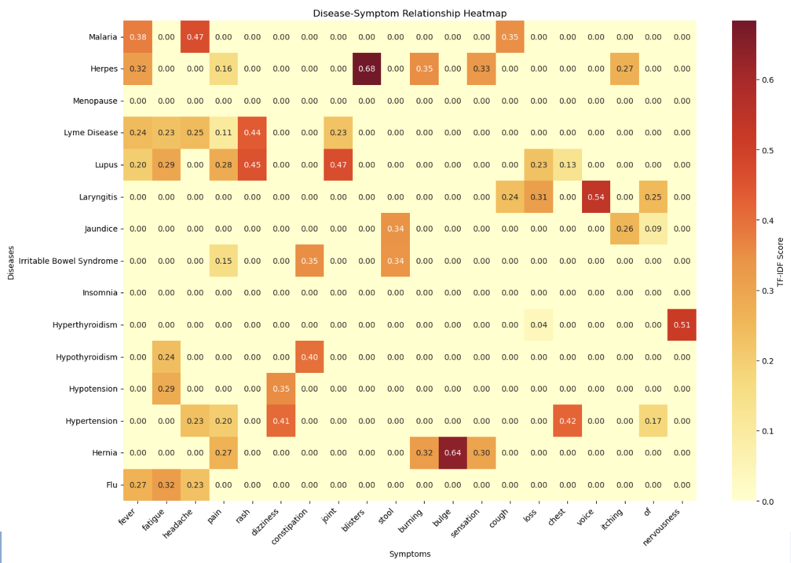
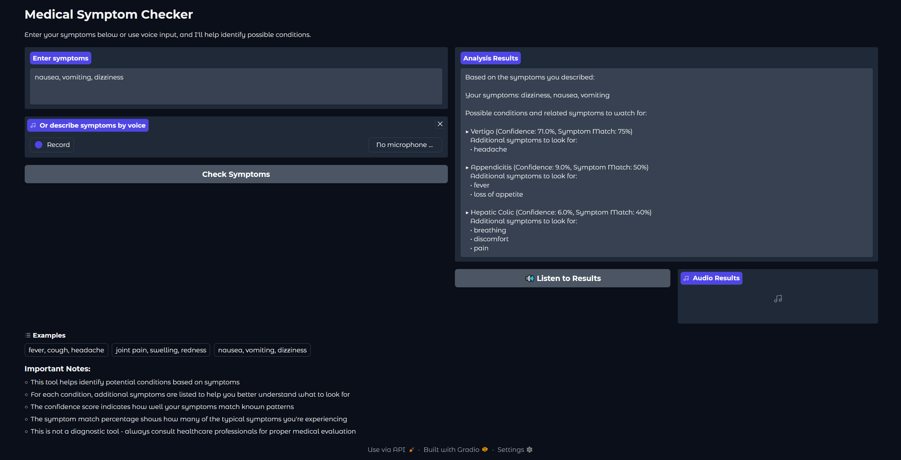

# The-Medi-Chat-Bot

# Predicting your prognosis based on the symptoms given: THE MediBot

A Machine Learning Project by Armand Araujo, Misha Hedman, Sami Chowdhury, and Dhwani Patel

# Executive Summary  

Our project goal is to create a sophisticated medical symptom checker that leverages user-reported symptoms to determine potential illnesses. We created a classifier trained off a dataset of disease-symptom pairs processed using TF-IDF, and then implemented that model into a gradio app that can be interfaced via speech-to-text or traditional text. This app would then classify the prognosis based on user entered symptomsg-edge diagnostic software.

# Table of Contents

- [Installation & Usage](#installation--usage)
  - [File Structure](#basic-file-structure)
  - [Prerequisites](#prerequisites)
  - [Setup](#setup)
- [Data Collection & Preprocessing](#data-collection--preprocessing)
  - [Initial Exploration](#initial-exploration)
  - [Preprocessing and Cleaning](#preprocessing-and-cleaning)
  - [Machine Learning Model Methodology](#machine-learning-model-methodology)
- [Analysis & Results](#analysis--results)
    - [Initial Machine Learning Model](#initial-machine-learning-model)
    - [Hypertuned Machine Learning Model](#hypertuned-machine-learning-model)
    - [Testing our Model](#testing-our-model)
    - [Implementation in Gradio](#implementation-in-gradio)
- [Limitations and Considerations](#limitations-and-considerations)
- [Summary of Findings](#summary-of-findings)
- [Potential Next Steps](#potential-next-steps)
- [Contributers](#contributors)
- [Acknowledgments](#acknowledgments)
- [Repository Structure](#repository-structure)

# Installation & Usage  

## Basic File Structure

```
├── Resources/
├──── disease_symptoms.csv
├── .gitattributes
├── the-medichat-bot.ipynb
├── README.md
```

## Prerequisites

- Latest version of Python

- The following Python Libraries must be installed:
    1. **pandas** : needed for general data frame management
    2. **seaborn** : needed for creating correlation heat maps
    3. **plt** : needed for visualizations of data
    4. **regex ("re" library)**: needed for regex operations
    5. **numpy** : needed for numerical operations
    6. **nltk** : needed to import stop words and word tokenization
    7. **sklearn** : needed for preprocessing the data, creating the machine learning classification models, and optimizing the models
    8. **tensorflow** : needed for creating tensorflow models and processing the data
    9. **joblib** : needed for saving and loading the models
    10. **gradio**: needed for running the final application that hosts the chatbot
    11. **SpeechRecognition** : needed to interact with the gradio app through voice
    12. **gtts** : needed for text to speech for the chatbot
    13. **whisper** : load speech model for speech to text

- Git version control system

- Internet connection for data downloads

## Setup

- Clone this repository: <https://github.com/Armand57araujo/the-medi-chat.git>

- Install required packages mentioned in the prerequisites

- Launch Jupyter Notebook

- Download required datasets and ensure it is in the **Resources/** directory. The data (in French) is located [at this link](https://www.kaggle.com/datasets/amaelbogne/medical-symptoms).

- Verify file integrity using provided checksums

# Data Collection & Preprocessing

## Initial Exploration

The original dataset was a French dataset about diseases and their many symptoms, which we translated into English. We reviewed the contents of the dataset, noting the column names, name of each row, and how each column correlated to each row by reviewing the unqiue values. We listed them out to get a better understanding of how we wanted to train our chatbot with these values. 

Below is a heatmap that shows a heat correlation map between the diseases and their symptoms.



- **Fig 1.1: Correlation Heatmap of each disease to the target symptom variables**

## Preprocessing and Cleaning

After exploring the data, our goal was to expand the dataset while maintaining the symptom relationship tot he disease column. We cleaned the text in the dataset using regex and utilized string manipulation to keep the data consistent. While preprocessing the data, we noticed that the feature columns for each disease were not balanced. Initially we had tried utilizing SMOTE to balance the data, but reverted once we realized the models we created from that data were not accurate at all. 

As a result, we created a few additional variations of symptoms for each disease entry to ensure that the data was balanced. The final dataframe consisted of the original disease symptom pairs with five variations for each original pair, ensuring that the dataset was balanced and still preserved its meaningful medical relatinoships between diseases and their symptoms. We also reduced the amount of samples for each disease to only have 6 samples. This would prevent any overfitting for specific disease types.


## Machine Learning Model Methodology

When preparing our data for our machine learning model, we utilized TF-IDF vectorization to transform the textual symptom data into numerical features appropriate for machine learning. We then used a Random Forest Classifier model to train off of our dataset. We also created a pipeline to handle the disease inputs and make predictions about the possible prognosis outcomes with top preidctions and confidence scores associated. This kept our output consistent in rpocessing symptoms with informative outputs.

# Analysis & Results

After exploring the data and understanding how certain symptoms could be good indicators for certain diseases, we set out to answer the following questions regarding our dataset:

1. What optimal model should we use to classify the symptoms given by users?
2. How can we address edge cases to ensure our output handles all types of test cases?
3. What medium should we use to display our chatbot?

## Initial Machine Learning Model 

We implemented a Random Forest machine learning classifier to train off our dataset.TF-IDF characteristics obtained from preprocessed symptom text were used to train the Random Forest classifier. Below is a table that contains the intial parameters of the model.

**Table 1.1: Random Forest Parameters**

| Parameter | Value |
| --------- | ----- |
| n_estimators | 200 |
| max_depth | None |
| min_samples_split | 2 |
| min_samples_leaf | 1 |
| class_weight | balanced |

This model provided us with a 93.8% accuracy in determining prognosis outcomes from user-entered symptom data.

## Hypertuned Machine Learning Model

We then utilized the GridSearch method to explore the most optimal parameters for this model. Below is a table that contains the optimal parameters for the model.

**Table 2.1: Random Forest Optimal Parameters**

| Parameter | Value |
| --------- | ----- |
| n_estimators | 200 |
| max_depth | 30 |
| max_features | log2 |
| min_samples_split | 2 |
| min_samples_leaf | 1 |
| class_weight | balanced |

## Testing our Model

After creating our model, we performed routine testing of the model to ensure it would be able to handle edge cases as well as real-world scenarios. Below are two tables showcasing a few examples of our tests.

**Table 3.1: Edge Case Testing**

| Symptoms | Possible Prognosis 1| Possible Prognosis 2 | Possible Prognosis 3 |
| -------- | --------------------| --------------------|  --------------------| 
| cough, fever, headache | Toothache (Confidence: 25.0%, Symptom Match: 50%) / Additional Symptoms: pain, swelling | Malaria (Confidence: 22.5%, Symptom Match: 60%) / Additional Symptoms: vomiting, weakness | Anthrax (Confidence: 14.0%, Symptom Match: 25%) / Additional Symptoms: chills, lethargy, malaise |

**Table 3.2: Real World Scenario**

| Symptoms | Possible Prognosis 1| Possible Prognosis 2 | Possible Prognosis 3 |
| -------- | --------------------| --------------------|  --------------------| 
| cough, fever, mild, runny nose, sore throat | Tonsillitis (Confidence: 57.5%, Symptom Match: 40%) / Additional Symptoms: difficulty swallowing, swollen, tonsils | Whooping Cough (Confidence: 14.0%, Symptom Match: 80%) / Additional Symptoms: sneezing | Flu (Confidence: 6.5%, Symptom Match: 33%) / Additional Symptoms: aches, fatigue, headache, muscle |


## Implementation in Gradio

We decided to implement the app inside Gradio. We also utilized OpenAI's whisper model to translate voiced symptoms into text, as well as using gTTS to convert the predicted prognosis into an auditory feedback file. These functions were implemented using pipeline functions that would take user text or speech inputs, process and converting them into features to be used by our model, and then perform the predictions. The Gradio app would also display a window of what possible symptoms could also be found and the confidence levels for each prognosis predicted. 

Below is a test sample of what our Gradio App was able to produce. 



- **Fig 2.1: Gradio Web Interface**

# Challenges Encountered

1. **Unbalanced dataset requiring data augmentation**

- The dataset was unbalanced and did not have an even split amongst features for all the target variables. As such, we needed to utilize data augmentation to balance it, which created some losses and augments of data. 

2. **Conversational aspect lost**

- Our web app only functions well when a list of symptoms are given. Since we were not able to train and create an NLP model, the conversational aspect of our chatbot isn't as pronounced. Given more time, we would have implemented this missing feature to make our chatbot more accessible.

3. **Lack of retraining**

- Without logging of the data provided by users, we cannot further train our model to make it more accurate. Implementing surveys asking users if the output prognosis seems reasonable would be fundamental in increasing the efficiency of our model.

4. **Data Accuracy**

- Since the data required translations from French to English, this could cause the model to be slightly awkward when predicting outcomes. In addition, our data was very basic and not varied, which leaves much to be desired for our model's implementation.

# Limitations and Considerations

When using our chatbot, there are some limitations and considerations that must be kept in mind. One big limitation is that our chatbot cannot fully interpret sentences. After the input is parsed, each word would get passed into our model, and would therefore not be relevant data when predicting prognosis outcomes. As such, it is better to use this model by listing symptoms in the gradio web interface. Another consideration is that our model was not trained off of conversational data. This means that our model is very rigid in trying to determine possible prognosis outcomes. As such, future implementations would consider combining both approaches of training off of numerical and conversational data in order to create a more robust solution. 

# Summary of Findings

Our project effectively combines data-driven machine learning with audio processing to create an interactive medical symptom checker. We were able to create a machine learning model that could then take in vectorized text input to be able to produce a prognosis for users. The chatbot functions as a proof-of-concept for using ensemble methods with natural language processing in a medical context.

When developing the model, we handled a variety of symptom descriptions, which required a great deal of data purification and translation. We had to utilize different techniques to transform the data so that our models could be efficiently built. We also implemented a modular design with the pipeline method, allowing for independent optimization of each stage from data collecting to model evaluation and audio integration. The tool was also built with the user being the main focus group, as we were able to incorporate both text-to-speech and speech-to-text features. 

# Potential Next Steps

One potential consideration for next steps involves data expansion and diversity. We would want to make the model more resilient by incorporating a wider variety of datasets. This could include electronic health records and involving more than just symptoms as data. We would also consider merging the data from multiple nations to get a more diverse range of symptom descriptions. This could also help us identify diseases that may be specific to certain groups of people.

Another area that we would want to improve this project is by utilizing more advanced modeling techniques. Our machine learning model mainly used numerical data, but we would want to in the future examine deep learning models (such as BERT and transformers) to improve the understanding of natural language for the model. This would enable our chatbot to be more conversational in nature and allowing for broader inputs from users. We would also want to provide a more complete diagnosis, which could take into account multimodal learning. This would combine text, audio, and maybe visual data to help us better aid users.

Lastly, we would plan to enable clinical integration and real-time personalization for our project. One way would be creating mechanisms for integrating data in real time to deliver personalized health information. Whether that would be through logging real time data or utilizing newer data through generative AI, we could increase the effectiveness and efficiency of our chatbot. Another way would be collaborating with medical specialists to assess clinical findings and make recommendations for diagnosis. Acquiring professional advice to improve our chatbots would make it more rigid and realistic to use for general users. However, in doing so, we would have to address privacy, legal, and ethical issues and notices for the chatbot. Ensuring that we do not create an unethical chatbot would be of the utmost importance

# Contributors  

- [Armand Araujo](https://github.com/Armand57araujo): Project Lead, Data Sourcing, Data Cleaning, Data Preprocessing
- [Misha Hedman](https://github.com/MishaHedman) : Project Lead, Data Sourcing, Data Modeling
- [Sami Chowdhury](https://github.com/SamiC2): Data Modeling, App Building
- [Dhwani Patel](https://github.com/dhwani0619): Data Visualization

# Acknowledgments

- Data providers: Kaggle ([Amael Bogne](https://www.kaggle.com/datasets/amaelbogne/medical-symptoms))
- Academic advisors

# Repository Structure

```
├── Images/
├──── fig1.1_correlation_heatmap.png
├──── fig2.1_gradio_webapp.png
├── Resources/
├──── disease_symptoms.csv
├── .gitattributes
├── the-medichat-bot.ipynb
├── README.md
```
